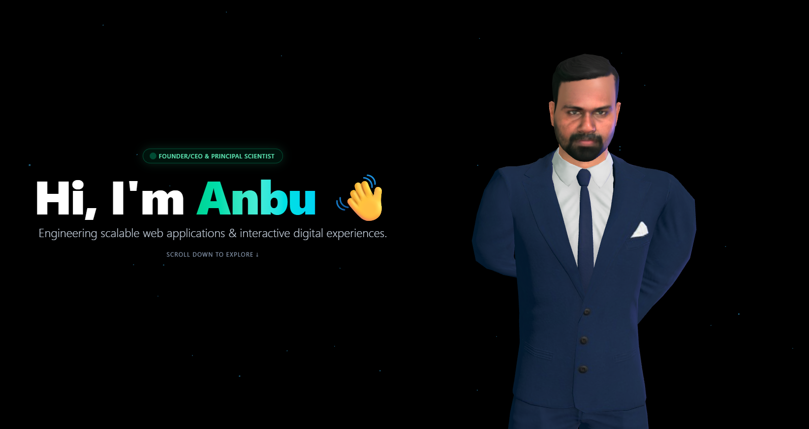

# 🌐 3D Interactive Portfolio with Three.js & Tailwind CSS

An interactive, scroll-driven 3D developer portfolio powered by **Three.js**, **Tailwind CSS**, and modern web standards. It features a customizable 3D GLTF avatar with interactive head and eye tracking, a procedural eyelid blinking system, natural resting arm postures, and scroll-linked camera interpolation.

---

## 📸 Screenshots



---

## ✨ Features

- **Dynamic 3D Character Rendering:** Real-time WebGL rendering via Three.js with custom GLTF models.
- **Procedural Eyelid Animation:** Custom spherical eyelid occluders mapped to the head rig for autonomous, natural blinking cycles without requiring pre-baked blendshapes.
- **Natural Posture Correction:** Euler-order constrained bone transforms preventing joint inversion or arm clipping during resting poses.
- **Interactive Micro-tracking:** Real-time pointer tracking with smooth damping (`MathUtils.lerp`) driving head orientation and ocular saccades.
- **Scroll-Linked Cinematic Camera:** Smooth multi-section transitions that interpolate camera angles and focus areas as the user scrolls.
- **Dynamic Lighting Atmosphere:** Ambient, key directional, and mouse-reactive accent point lights that shift intensity on interactive card hover states.
- **Custom Starfield Backdrop:** High-performance particle buffer geometry animating gently in the background.

---

## 🛠️ Tech Stack

- **Core 3D Engine:** [Three.js](https://threejs.org/) (`v0.160+`)
- **Model Loader:** `three/examples/jsm/loaders/GLTFLoader.js`
- **Styling:** [Tailwind CSS](https://tailwindcss.com/)
- **Bundler:** Vite
- **Avatar Platform:** Avaturn / Ready Player Me compatible

---

## 📁 Project Structure

```text
├── public/
│   └── anbu-avatar.glb       # Optimized 3D character model
├── screenshots/
│   ├── hero-preview.png      # Hero showcase image
│   └── about-preview.png     # Section preview image
├── src/
│   ├── main.js               # Three.js scene, camera, lights, and animation loop
│   └── style.css             # Tailwind CSS entrypoint and custom styling
├── index.html                # Main canvas and UI overlay markup
├── package.json
└── README.md
```

## Author - Anbuselvan Annamalai
